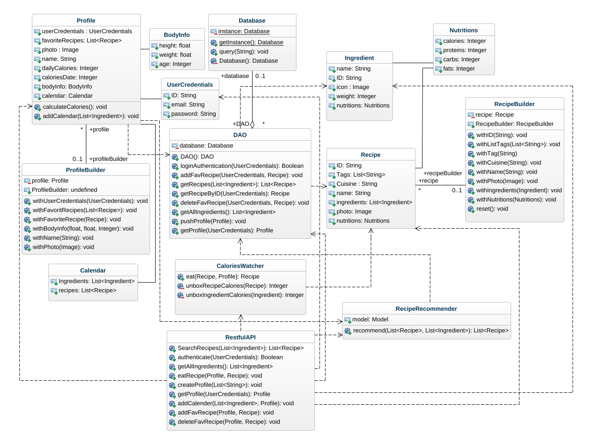
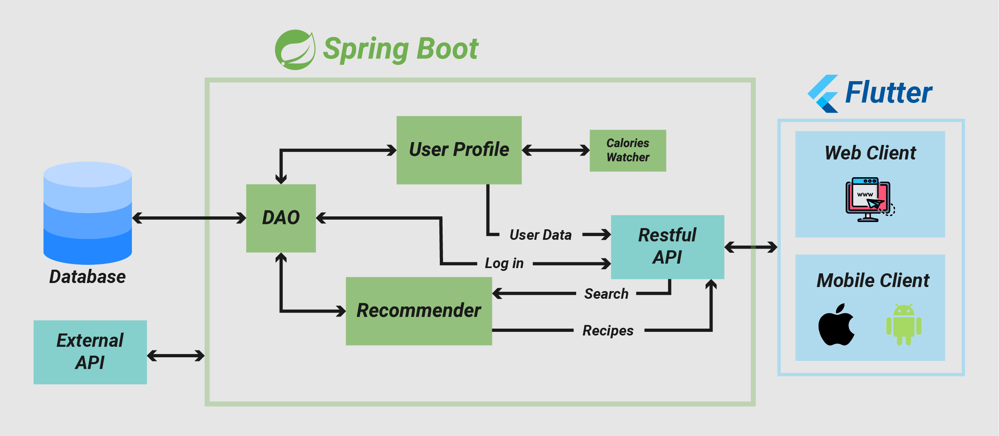

# **Overall Designs**
1. [Class Diagram](#1-Class-Diagram)

2. [Database Schema](#2-Database-Schema)

3. [Sequence Diagram](#3-Sequence-Diagram*)

4. [System Main Components](#4-System-Main-Components*)

## **1.Class Diagram**

## **2.Database Schema**

## **3.Sequence Diagram**

## **4.System Main Component**

