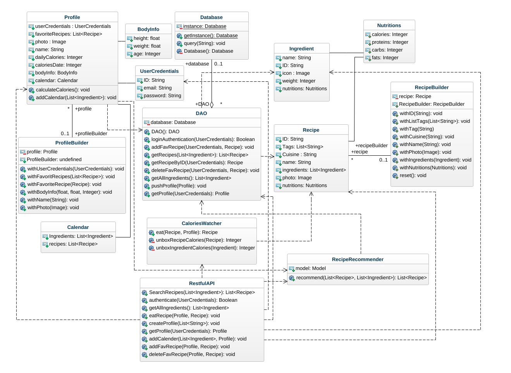
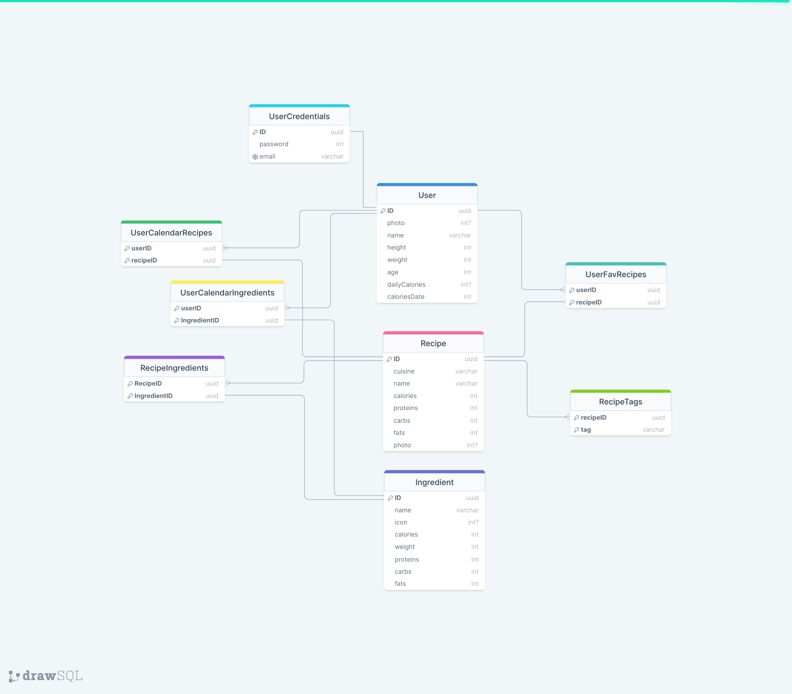
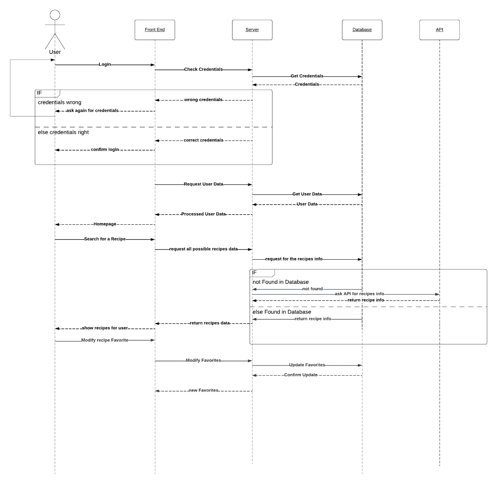
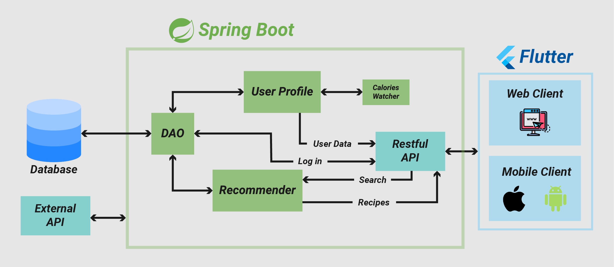
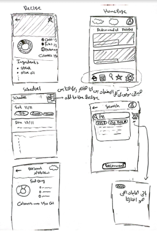

# **Overall Designs**
1. [Class Diagram](#1class-diagram)

2. [Database Schema](#2database-schema)

3. [Sequence Diagram](#3sequence-diagram)

4. [System Main Components](#4system-main-components)

5. [UI Design Sketch](#5ui-design-sketch)

## **1.Class Diagram**

## **2.Database Schema**

## **3.Sequence Diagram**

## **4.System Main Components**

## **5.UI Design sketch**

